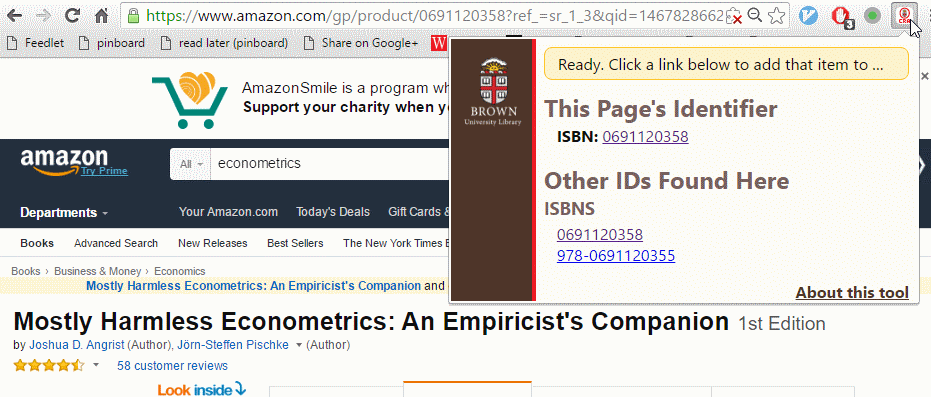
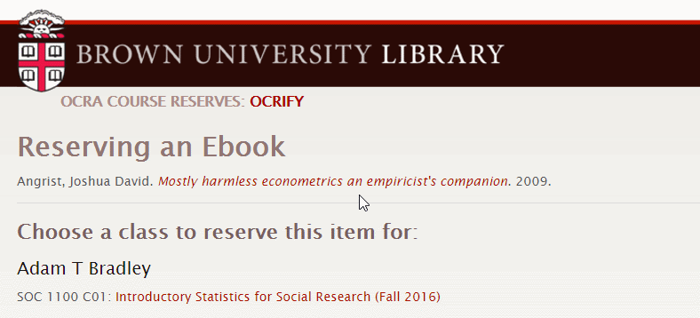
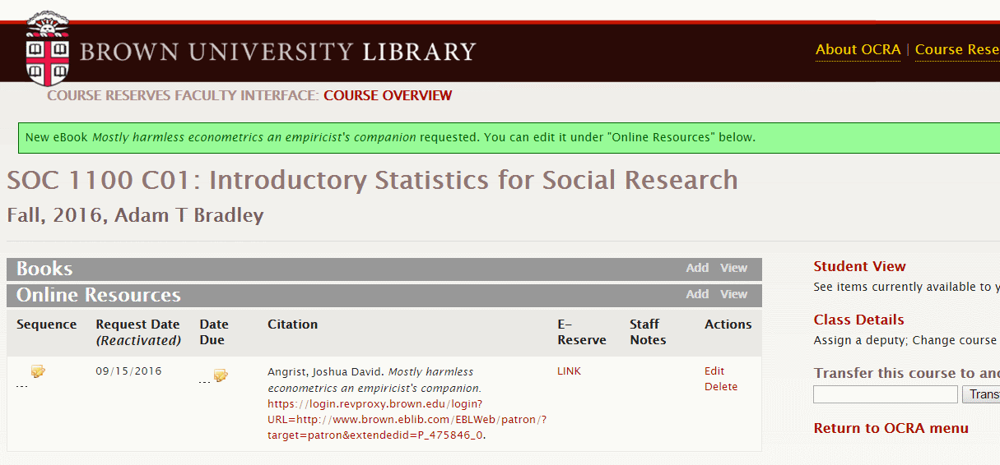

#### OCRA Chrome Extension

The Ocrifier tool is designed to make it easy for OCRA users (faculty and staff) to add items from the Internet to course reserves. Click the Ocrify button  on any page to add a URL or a reference to a book or article to any of your OCRA courses.

##### Step 1

On any web page containing identifiers like ISBNs, DOIs, or PubMed IDs; or any page you'd like to include a link to in your OCRA class page, click the OCRA button in Chrome's toolbar.  

If you see the item you want to add listed, click its identifier to go to OCRA.

##### Step 2

OCRA describes the item it found for the identifier you selected and lists all classes you have access to.  Verify that OCRA found the right item, then choose the class you want to add the item to.  

##### Step 3

OCRA adds the item to your class; you can edit it from here.  
